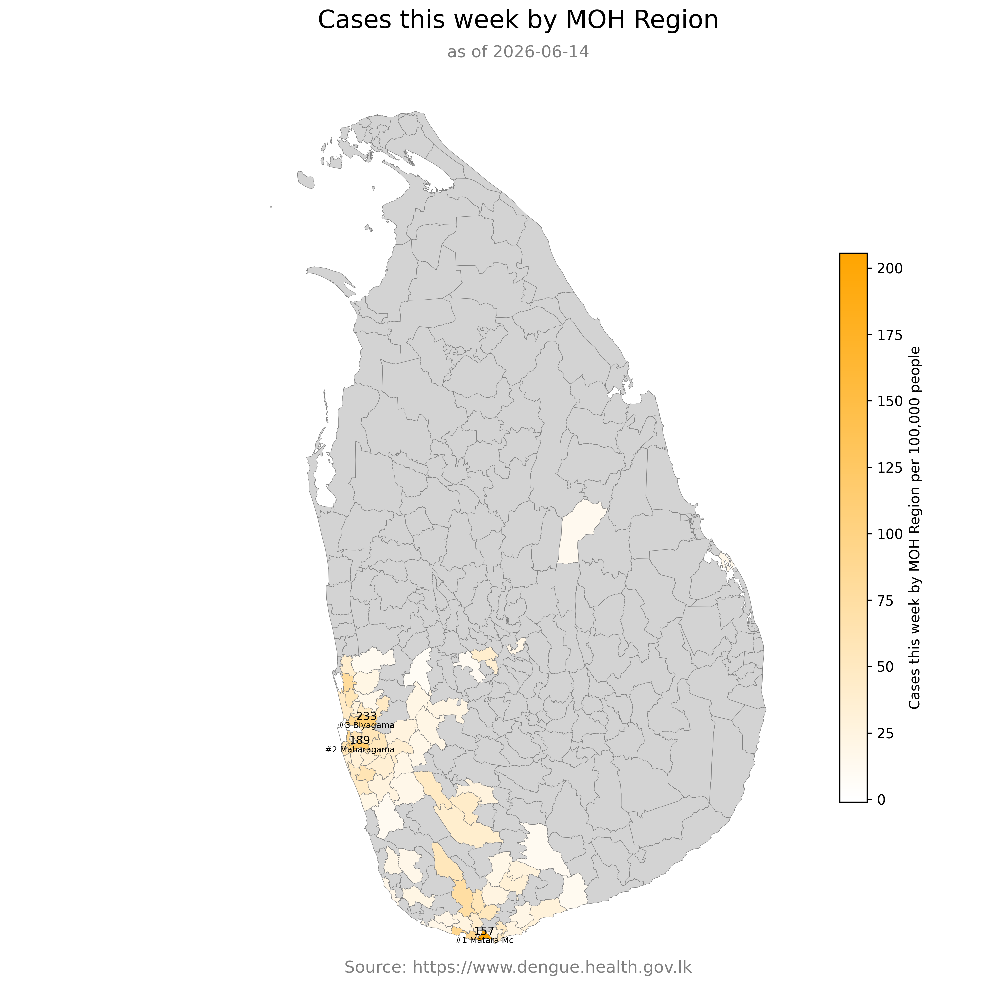

# Dengue in Sri Lanka 🇱🇰

Datasets scraped from [National Dengue Control Unit](https://www.dengue.health.gov.lk/) Website.

## Cases this week

## Additional Cases this week (compared to last week)

_by_region.png)

## Additional Cases this week (compared to this week, last year)

_by_region.png)

## Cumulative Deaths in 2026

## Cumulative Cases in 2026

## Cases this week by MOH Region

## Cases by MOH Regions

As of 2026-06-14

| ID | District | MOH Area | Cases Last Week | Cases This Week |
| --- | --- | --- | ---: | ---: |
| LK-12-Biyagama | Gampaha | Biyagama | 132 | 233 |
| LK-11-Maharagama | Colombo | Maharagama | 121 | 189 |
| LK-32-Matara-Mc | Matara | Matara MC | 85 | 157 |
| LK-12-Kelaniya | Gampaha | Kelaniya | 84 | 119 |
| LK-13-Panadura | Kalutara | Panadura | 45 | 113 |
| LK-11-Kaduwela | Colombo | Kaduwela | 80 | 109 |
| LK-12-Mahara | Gampaha | Mahara | 62 | 108 |
| LK-11-Homagama | Colombo | Homagama | 41 | 99 |
| LK-12-Seeduwa | Gampaha | Seeduwa | 56 | 96 |
| ⚠️ Unknown | Colombo | Gothatuwa | 47 | 86 |
| LK-12-Ja-Ela | Gampaha | Ja-Ela | 52 | 80 |
| LK-12-Wattala | Gampaha | Wattala | 46 | 75 |
| LK-13-Bandaragama | Kalutara | Bandaragama | 54 | 75 |
| LK-31-Bope-Poddala | Galle | Bope Poddala | 41 | 72 |
| LK-21-Kandy-Four-Gravets-&-Gangawata-Korale | Kandy | Kandy MC | 52 | 71 |
| LK-32-Weligama | Matara | Weligama | 26 | 69 |
| LK-11-Nugegoda | Colombo | Nugegoda | 31 | 66 |
| LK-11-Piliyandala | Colombo | Piliyandala | 20 | 66 |
| LK-12-Negambo | Gampaha | Negombo | 19 | 56 |
| LK-11-Boralesgamuwa | Colombo | Boralesgamuwa | 31 | 55 |
| LK-11-Dehiwala | Colombo | Dehiwala | 25 | 55 |
| LK-11-Battaramulla | Colombo | Battaramulla | 30 | 54 |
| LK-11-Rathmalana | Colombo | Rathmalana | 24 | 50 |
| LK-12-Katana | Gampaha | Katana | 25 | 49 |
| LK-11-Moratuwa | Colombo | Moratuwa | 32 | 48 |
| LK-13-Horana | Kalutara | Horana | 34 | 48 |
| ⚠️ Unknown | Colombo | D3-CMC | 22 | 45 |
| LK-21-Yatinuwara | Kandy | Yatinuwara | 42 | 45 |
| LK-12-Minuwangoda | Gampaha | Minuwangoda | 47 | 44 |
| LK-31-Galle-Four-Gravets | Galle | MC-Galle | 10 | 40 |
| LK-12-Dompe | Gampaha | Pugoda(Dompe) | 26 | 39 |
| ⚠️ Unknown | Kandy | Gampola | 17 | 39 |
| LK-21-Ganga-Ihala-Korale | Kandy | Gangawata Korale | 23 | 39 |
| LK-32-Akuressa | Matara | Akuressa | 12 | 39 |
| ⚠️ Unknown | Colombo | D4-CMC | 23 | 35 |
| LK-11-Kahathuduwa | Colombo | Kahathuduwa | 19 | 35 |
| ⚠️ Unknown | Colombo | Egodauyana | 23 | 34 |
| LK-12-Gampaha | Gampaha | Gampaha | 27 | 34 |
| LK-11-Hanwella | Colombo | Hanwella | 40 | 33 |
| LK-12-Attanagalla | Gampaha | Aththanagalla | 23 | 33 |
| ⚠️ Unknown | Kalutara | Wadduwa | 24 | 32 |
| LK-12-Mirigama | Gampaha | Meerigama | 16 | 31 |
| LK-62-Chilaw | Puttalam | Chilaw | 9 | 31 |
| LK-11-Padukka | Colombo | Padukka | 36 | 28 |
| LK-13-Kalutara | Kalutara | Kalutara | 29 | 28 |
| LK-81-Badulla | Badulla | Badulla | 11 | 26 |
| LK-21-Udunuwara | Kandy | Udunuwara | 19 | 26 |
| LK-91-Nivithigala | Ratnapura | Nivithigala | 21 | 26 |
| LK-13-Madurawala | Kalutara | Madurawala | 16 | 25 |
| LK-32-Devinuwara | Matara | Devinuwara | 16 | 25 |
| LK-91-Pelmadulla | Ratnapura | Pelmadulla | 32 | 25 |
| LK-91-Ratnapura-Mc | Ratnapura | Rathnapura MC | 21 | 25 |
| ⚠️ Unknown | Colombo | D5-CMC | 9 | 24 |
| LK-33-Tangalle | Hambantota | Tangalle | 22 | 24 |
| LK-12-Ragama | Gampaha | Ragama | 22 | 23 |
| ⚠️ Unknown | Kandy | Waththegama | 11 | 23 |
| LK-32-Kamburupitiya | Matara | Kamburupitiya | 2 | 23 |
| ⚠️ Unknown | Matara | Morawaka | 7 | 22 |
| LK-71-Palagala | Kalutara | Payagala | 24 | 21 |
| ⚠️ Unknown | Kandy | Werellagama | 16 | 21 |
| ⚠️ Unknown | Colombo | D1-CMC | 9 | 20 |
| LK-11-Pitakotte | Colombo | Pitakotte | 12 | 20 |
| LK-12-Divulapitiya | Gampaha | Divulapitiya | 11 | 20 |
| LK-91-Kalawana | Ratnapura | Kalawana | 8 | 20 |
| LK-91-Kuruwita | Ratnapura | Kuruvita | 25 | 20 |
| ⚠️ Unknown | Colombo | Kesbewa | 28 | 19 |
| LK-32-Athuraliya | Matara | Athuraliya | 13 | 19 |
| LK-92-Dehiovita | Kegalle | Dehiovita | 29 | 18 |
| LK-91-Embilipitiya | Ratnapura | Embilipitiya | 28 | 18 |
| LK-31-Baddegama | Galle | Baddegama | 6 | 17 |
| LK-31-Thawalama | Galle | Thawalama | 5 | 17 |
| LK-33-Walasmulla | Hambantota | Walasmulla | 9 | 16 |
| ⚠️ Unknown | Colombo | D2A-CMC | 7 | 15 |
| LK-33-Katuwana | Hambantota | Katuwana | 13 | 15 |
| LK-13-Mathugama | Kalutara | Mathugama | 6 | 15 |
| LK-21-Pasbage-Korale | Kandy | Pasbage | 21 | 15 |
| LK-32-Malimbada | Matara | Malimbada | 6 | 15 |
| LK-91-Ayagama | Ratnapura | Ayagama | 11 | 15 |
| LK-91-Ratnapura | Ratnapura | Ratnapura PS | 30 | 15 |
| LK-51-Batticaloa | Batticaloa | Batticaloa | 24 | 14 |
| LK-21-Menikhinna | Kandy | Menikhinna | 13 | 14 |
| LK-92-Mawanella | Kegalle | Mawanella | 14 | 14 |
| LK-92-Ruwanwella | Kegalle | Ruwanwella | 8 | 14 |
| LK-92-Yatiyanthota | Kegalle | Yatiyanthota | 9 | 14 |
| LK-61-Kuliyapitiya | Kurunegala | Kuliyapitiya | 2 | 14 |
| LK-32-Dickwella | Matara | Dickwella | 8 | 14 |
| LK-32-Welipitiya | Matara | Welipitiya | 4 | 14 |
| LK-91-Eheliyagoda | Ratnapura | Eheliyagoda | 11 | 14 |
| LK-31-Karandeniya | Galle | Karandeniya | 8 | 13 |
| LK-61-Mallawapitiya | Kurunegala | Mallawapitiya | 10 | 13 |
| ⚠️ Unknown | Matara | Deniyaya | 9 | 13 |
| LK-32-Mulatiyana | Matara | Mulatiyana | 6 | 13 |
| LK-62-Wennappuwa | Puttalam | Wennappuwa | 18 | 13 |
| LK-11-Kolonnawa | Colombo | Kolonnawa | 5 | 12 |
| LK-31-Elpitiya | Galle | Elpitiya | 8 | 12 |
| LK-31-Habaraduwa | Galle | Habaraduwa | 4 | 12 |
| LK-33-Beliatta | Hambantota | Beliatta | 8 | 12 |
| LK-13-Bulathsinhala | Kalutara | Bulathsinhala | 13 | 12 |
| LK-13-Ingiriya | Kalutara | Ingiriya | 30 | 12 |
| LK-32-Pasgoda | Matara | Pasgoda | 2 | 12 |
| LK-72-Thamankaduwa | Polonnaruwa | Thamankaduwa | 7 | 12 |
| ⚠️ Unknown | Colombo | D2B-CMC | 13 | 11 |
| LK-31-Hikkaduwa | Galle | Hikkaduwa | 3 | 11 |
| ⚠️ Unknown | Kalutara | Millaniya | 14 | 11 |
| ⚠️ Unknown | Kandy | Thalathuoya | 6 | 11 |
| LK-32-Matara-Ps | Matara | Matara PS | 14 | 11 |
| LK-31-Imaduwa | Galle | Imaduwa | 4 | 10 |
| LK-33-Ambalantota | Hambantota | Ambalantota | 9 | 10 |
| ⚠️ Unknown | Kandy | Kurunduwaththa | 5 | 10 |
| LK-92-Warakapola | Kegalle | Warakapola | 14 | 10 |
| ⚠️ Unknown | Puttalam | Madampe | 5 | 10 |
| LK-91-Kahawaththa | Ratnapura | Kahawatta | 12 | 10 |

## Cases by Hospitals

As of 2026-06-14

| Hospital | Cases Last Week | Cases This Week |
| --- | ---: | ---: |
| TH-Matara | 133 | 166 |
| NIID | 133 | 155 |
| TH - Ratnapura | 51 | 122 |
| DGH - Negombo | 50 | 106 |
| TH - Colombo South | 70 | 104 |
| NHSL | 60 | 93 |
| TH - Colombo North | 68 | 84 |
| NH - Galle | 48 | 65 |
| NH - Kandy | 40 | 61 |
| TH - Peradeniya | 42 | 54 |
| BH - Panadura | 27 | 48 |
| LRH | 34 | 43 |
| TH - Kalutara | 22 | 43 |
| DGH - Horana | 38 | 40 |
| TH - Kurunegala | 30 | 40 |
| DGH - Gampaha | 28 | 37 |
| BH - Tangalle | 22 | 32 |
| DGH-Avissawella | 27 | 32 |
| BH - Kamburupitiya | 18 | 24 |
| PGH - Badulla | 15 | 22 |
| TH - Kuliyapitiya | 7 | 20 |
| DGH - Chilaw | 6 | 18 |
| BH - Balangoda | 10 | 15 |
| BH - Gampola | 8 | 15 |
| BH - Kahawatta | 16 | 14 |
| BH - Minuwangoda | 10 | 13 |
| DGH - Nawalapitiya | 10 | 13 |
| DGH - Polonnaruwa | 7 | 13 |
| BH - Wathupitiwala | 12 | 12 |
| DGH - Embilipitiya | 7 | 12 |
| DGH Hambantota | 8 | 11 |
| BH - Warakapola | 7 | 10 |
| BH - Balapitiya | 7 | 9 |
| DGH - Ampara | 5 | 9 |
| TH - Batticaloa | 10 | 8 |
| DGH - Kegalle | 7 | 7 |
| BH - Mawanella | 7 | 5 |
| DGH - Matale | 6 | 5 |
| DGH - Moneragala | 3 | 5 |
| BH - Dambulla | 2 | 4 |
| BH - Mirigama | 3 | 4 |

## Appendix: Source Reports & Extracted Data

### [National Dengue Control Unit - Daily Update](data/NDCUDaily)

- [2026-06-23](data/NDCUDaily/2026/2026-06/2026-06-23)

### [National Dengue Control Unit - Weekly Update](data/NDCUWeekly)

- [2026-06-14](data/NDCUWeekly/2026/2026-06/2026-06-14)

