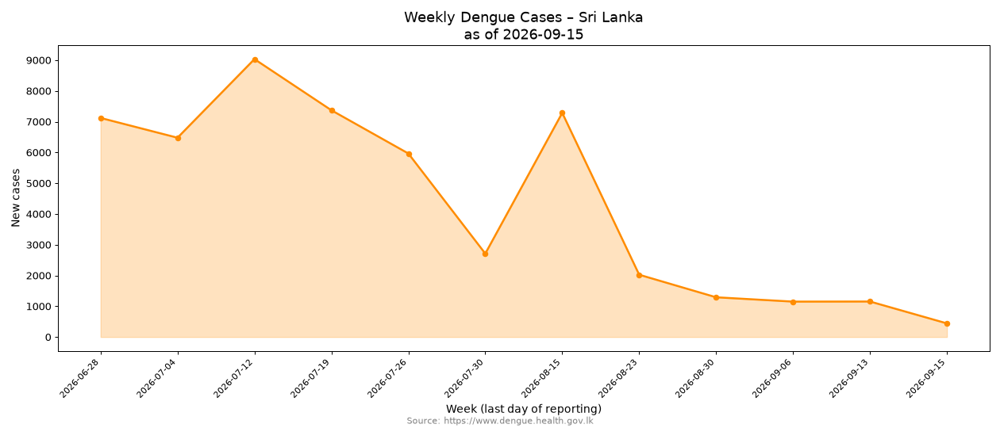
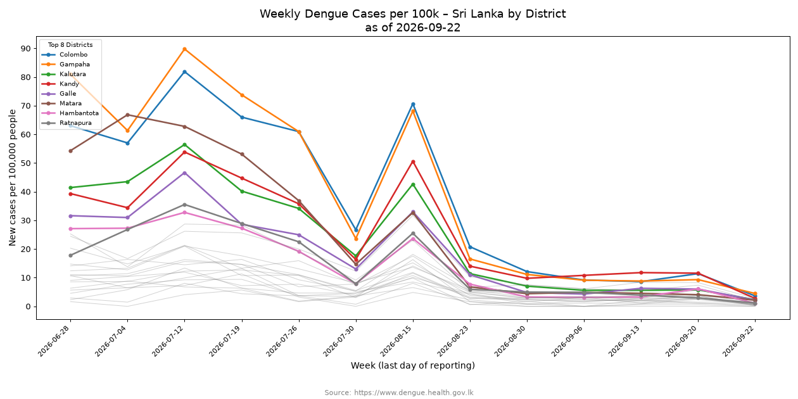
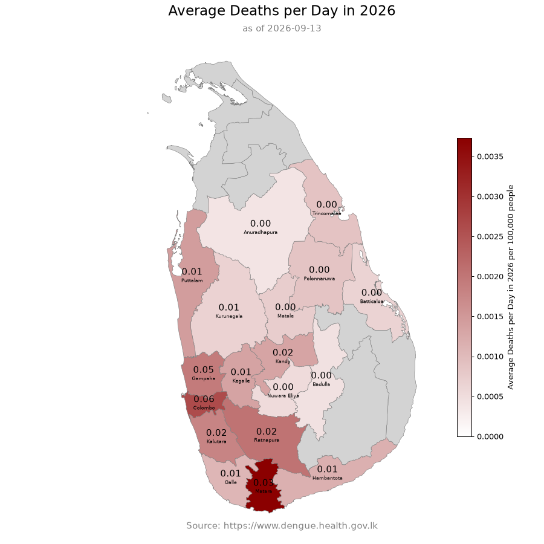
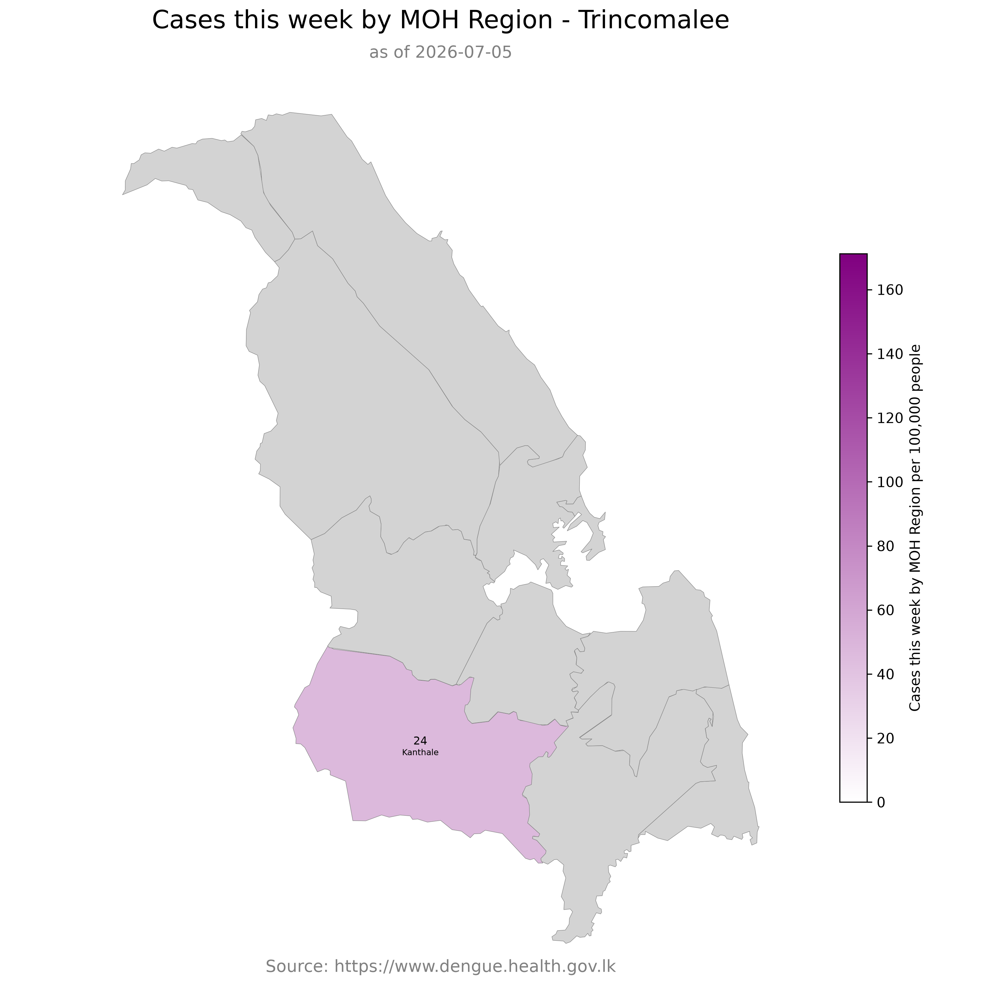

# Dengue in Sri Lanka 🇱🇰

Datasets scraped from [National Dengue Control Unit](https://www.dengue.health.gov.lk/) Website.

## Weekly Cases – Trend (National)

## Weekly Cases per 100k – Trend by District

## Cases this week

## Additional Cases this week (compared to last week)

_by_region.png)

## Additional Cases this week (compared to this week, last year)

_by_region.png)

## Average Deaths per Day in 2026

## Cumulative Cases in 2026

## Cases this week by MOH Region

⚠️ These maps are based on 2020 MOH Region boundaries. Several MOH Regions created since lack public geographic data, so they have been merged with their parent regions. E.g., Kesbewa, formed by splitting the Piliyandala MOH Region, is shown combined as "Kesbewa & Piliyandala."

### Colombo

### Kandy

### Kegalle

### Galle

### Badulla

### Puttalam

### Matara

### Hambantota

### Kurunegala

### Trincomalee

## Cases by MOH Regions

As of 2026-08-16

| District | MOH Area | Cases Last Week | Cases This Week | Change | Population (2024 Census) | Cases Last Week per 100k | Cases This Week per 100k |
| --- | --- | ---: | ---: | --- | ---: | ---: | ---: |
| Trincomalee | Padavisripura | 0 | 10 | 🔴 +10 | 11163 | 0.0 | 89.6 |
| Colombo | Homagama | 39 | 134 | 🔴 +95 | 179146 | 21.8 | 74.8 |
| Kandy | Pasbage | 30 | 30 | ⚪️ +0 | 65553 | 45.8 | 45.8 |
| Colombo | Pitakotte | 22 | 26 | 🔴 +4 | 61468 | 35.8 | 42.3 |
| Kandy | Gangawata Korale & Kurunduwaththa | 36 | 22 | 🟢 -14 | 53141 | 67.7 | 41.4 |
| Colombo | Maharagama | 80 | 58 | 🟢 -22 | 155965 | 51.3 | 37.2 |
| Colombo | Boralesgamuwa | 21 | 22 | 🔴 +1 | 59240 | 35.4 | 37.1 |
| Colombo | Battaramulla | 50 | 30 | 🟢 -20 | 87511 | 57.1 | 34.3 |
| Kegalle | Ruwanwella | 19 | 22 | 🔴 +3 | 65797 | 28.9 | 33.4 |
| Badulla | Bandarawela | 1 | 18 | 🔴 +17 | 65488 | 1.5 | 27.5 |
| Puttalam | Wennappuwa | 34 | 17 | 🟢 -17 | 64768 | 52.5 | 26.2 |
| Kandy | Werellagama | 26 | 25 | 🟢 -1 | 95757 | 27.2 | 26.1 |
| Puttalam | Dankotuwa | 19 | 16 | 🟢 -3 | 62873 | 30.2 | 25.4 |
| Galle | Imaduwa | 14 | 12 | 🟢 -2 | 48204 | 29.0 | 24.9 |
| Hambantota | Katuwana | 11 | 13 | 🔴 +2 | 52169 | 21.1 | 24.9 |
| Kandy | Kandy MC | 37 | 38 | 🔴 +1 | 152397 | 24.3 | 24.9 |
| Galle | MC-Galle | 26 | 26 | ⚪️ +0 | 108321 | 24.0 | 24.0 |
| Colombo | Dehiwala | 26 | 22 | 🟢 -4 | 93815 | 27.7 | 23.5 |
| Colombo | Kesbewa & Piliyandala | 62 | 48 | 🟢 -14 | 204301 | 30.3 | 23.5 |
| Colombo | Egodauyana & Moratuwa | 45 | 37 | 🟢 -8 | 160199 | 28.1 | 23.1 |
| Colombo | Hanwella | 31 | 28 | 🟢 -3 | 122128 | 25.4 | 22.9 |
| Colombo | Padukka | 9 | 16 | 🔴 +7 | 73014 | 12.3 | 21.9 |
| Colombo | Kaduwela | 72 | 38 | 🟢 -34 | 190407 | 37.8 | 20.0 |
| Colombo | Gothatuwa & Kolonnawa | 65 | 42 | 🟢 -23 | 214070 | 30.4 | 19.6 |
| Matara | Weligama | 12 | 14 | 🔴 +2 | 76136 | 15.8 | 18.4 |
| Colombo | Rathmalana | 25 | 16 | 🟢 -9 | 88063 | 28.4 | 18.2 |
| Kandy | Menikhinna | 13 | 12 | 🟢 -1 | 67384 | 19.3 | 17.8 |
| Kandy | Yatinuwara | 36 | 20 | 🟢 -16 | 113769 | 31.6 | 17.6 |
| Kegalle | Mawanella | 20 | 22 | 🔴 +2 | 126026 | 15.9 | 17.5 |
| Matara | Matara MC | 16 | 13 | 🟢 -3 | 76322 | 21.0 | 17.0 |
| Badulla | Badulla | 16 | 14 | 🟢 -2 | 83033 | 19.3 | 16.9 |
| Kandy | Thalathuoya | 13 | 10 | 🟢 -3 | 59835 | 21.7 | 16.7 |
| Kegalle | Yatiyanthota | 9 | 10 | 🔴 +1 | 62255 | 14.5 | 16.1 |
| Colombo | Nugegoda | 39 | 12 | 🟢 -27 | 75256 | 51.8 | 15.9 |
| Kandy | Udunuwara | 15 | 11 | 🟢 -4 | 70803 | 21.2 | 15.5 |
| Puttalam | Nattandiya | 11 | 10 | 🟢 -1 | 65500 | 16.8 | 15.3 |
| Kandy | Kundasale | 16 | 11 | 🟢 -5 | 73586 | 21.7 | 14.9 |
| Badulla | Welimada | 5 | 15 | 🔴 +10 | 105510 | 4.7 | 14.2 |
| Colombo | Kahathuduwa | 14 | 14 | ⚪️ +0 | 101625 | 13.8 | 13.8 |
| Kandy | Gampola | 19 | 15 | 🟢 -4 | 109092 | 17.4 | 13.7 |
| Galle | Baddegama | 8 | 10 | 🔴 +2 | 78658 | 10.2 | 12.7 |
| Colombo | CMC & D1-CMC & D2A-CMC & D2B-CMC & D3-CMC | 99 | 56 | 🟢 -43 | 508408 | 19.5 | 11.0 |
| Kegalle | Warakapola | 17 | 13 | 🟢 -4 | 117967 | 14.4 | 11.0 |
| Kandy | Waththegama | 12 | 10 | 🟢 -2 | 96889 | 12.4 | 10.3 |
| Kurunegala | Pannala | 13 | 11 | 🟢 -2 | 135845 | 9.6 | 8.1 |

## Cases by Hospitals

As of 2026-08-16

| Hospital | Cases Last Week | Cases This Week |
| --- | ---: | ---: |
|  | 0 | 3233 |
|  | 0 | 3233 |
|  | 0 | 3233 |
| NIID | 88 | 60 |
| NH - Kandy | 46 | 44 |
| TH - Colombo South | 76 | 44 |
| TH – Colombo North | 60 | 43 |
| DGH - Negambo | 72 | 42 |
| NHSL | 50 | 38 |
| NH – Galle | 50 | 32 |
| DGH - Gampaha | 34 | 31 |
| DGH - Matara | 41 | 27 |
| TH - Peradeniya | 39 | 24 |
| DGH - Avissawella | 25 | 23 |
| TH - Ratnapura | 41 | 21 |
| BH - Panadura | 34 | 19 |
| BH - Wathupitiwala | 17 | 19 |
| LRH | 31 | 19 |
| TH - Kalutara | 29 | 19 |
| DGH - Nawalapitiya | 17 | 17 |
| BH - Dambadeniya | 12 | 15 |
| BH - Marawila | 20 | 15 |
| BH - Tangalle | 16 | 14 |
| TH - Kurunegala | 22 | 14 |
| BH - Karawanella | 13 | 13 |
| TH - Anuradhapura | 13 | 13 |
| BH - Kamburupitiya | 14 | 12 |
| DGH - Kegalle | 14 | 11 |
| BH – Kalmunai North | 10 | 10 |
| DGH - Matale | 15 | 10 |
| BH - Mirigama | 5 | 9 |
| PGH - Badulla | 16 | 9 |
| BH - Balapitiya | 13 | 8 |
| BH - Gampola | 17 | 8 |
| BH - Mawanella | 11 | 8 |
| BH - Warakapola | 9 | 8 |
| BH - Kahawatta | 11 | 7 |
| DGH - Embilipitiya | 10 | 7 |
| DGH - Horana | 18 | 7 |
| DGH - Polonnaruwa | 5 | 7 |
| BH - Mahiyanganaya | 8 | 6 |
| BH - Minuwangoda | 9 | 6 |
| BH - Rikillagaskada | 6 | 6 |
| DGH - Hambantota | 5 | 6 |
| TH - Batticaloa | 5 | 6 |
| TH - Kuliyapitiya | 11 | 6 |
| DGH - Chilaw | 7 | 5 |
| BH - Balangoda | 12 | 4 |
| DGH - Ampara | 5 | 4 |
| DGH - Monaragala | 4 | 4 |

## Appendix: Source Reports & Extracted Data

### [National Dengue Control Unit - Daily Update](data/NDCUDaily)

- [2026-08-27](data/NDCUDaily/2026/2026-08/2026-08-27)
- [2026-08-26](data/NDCUDaily/2026/2026-08/2026-08-26)
- [2026-08-24](data/NDCUDaily/2026/2026-08/2026-08-24)
- [2026-08-23](data/NDCUDaily/2026/2026-08/2026-08-23)
- [2026-08-21](data/NDCUDaily/2026/2026-08/2026-08-21)
- [2026-08-15](data/NDCUDaily/2026/2026-08/2026-08-15)
- [2026-08-13](data/NDCUDaily/2026/2026-08/2026-08-13)
- [2026-08-12](data/NDCUDaily/2026/2026-08/2026-08-12)
- [2026-08-11](data/NDCUDaily/2026/2026-08/2026-08-11)
- [2026-08-10](data/NDCUDaily/2026/2026-08/2026-08-10)
- [2026-07-30](data/NDCUDaily/2026/2026-07/2026-07-30)
- [2026-07-29](data/NDCUDaily/2026/2026-07/2026-07-29)
- [2026-07-28](data/NDCUDaily/2026/2026-07/2026-07-28)
- [2026-07-27](data/NDCUDaily/2026/2026-07/2026-07-27)
- [2026-07-26](data/NDCUDaily/2026/2026-07/2026-07-26)
- [2026-07-25](data/NDCUDaily/2026/2026-07/2026-07-25)
- [2026-07-24](data/NDCUDaily/2026/2026-07/2026-07-24)
- [2026-07-23](data/NDCUDaily/2026/2026-07/2026-07-23)
- [2026-07-22](data/NDCUDaily/2026/2026-07/2026-07-22)
- [2026-07-21](data/NDCUDaily/2026/2026-07/2026-07-21)
- [2026-07-20](data/NDCUDaily/2026/2026-07/2026-07-20)
- [2026-07-19](data/NDCUDaily/2026/2026-07/2026-07-19)
- [2026-07-18](data/NDCUDaily/2026/2026-07/2026-07-18)
- [2026-07-17](data/NDCUDaily/2026/2026-07/2026-07-17)
- [2026-07-16](data/NDCUDaily/2026/2026-07/2026-07-16)
- [2026-07-15](data/NDCUDaily/2026/2026-07/2026-07-15)
- [2026-07-14](data/NDCUDaily/2026/2026-07/2026-07-14)
- [2026-07-13](data/NDCUDaily/2026/2026-07/2026-07-13)
- [2026-07-12](data/NDCUDaily/2026/2026-07/2026-07-12)
- [2026-07-11](data/NDCUDaily/2026/2026-07/2026-07-11)
- [2026-07-10](data/NDCUDaily/2026/2026-07/2026-07-10)
- [2026-07-09](data/NDCUDaily/2026/2026-07/2026-07-09)
- [2026-07-08](data/NDCUDaily/2026/2026-07/2026-07-08)
- [2026-07-07](data/NDCUDaily/2026/2026-07/2026-07-07)
- [2026-07-06](data/NDCUDaily/2026/2026-07/2026-07-06)
- [2026-07-04](data/NDCUDaily/2026/2026-07/2026-07-04)
- [2026-07-03](data/NDCUDaily/2026/2026-07/2026-07-03)
- [2026-07-02](data/NDCUDaily/2026/2026-07/2026-07-02)
- [2026-07-01](data/NDCUDaily/2026/2026-07/2026-07-01)
- [2026-06-30](data/NDCUDaily/2026/2026-06/2026-06-30)
- [2026-06-29](data/NDCUDaily/2026/2026-06/2026-06-29)
- [2026-06-28](data/NDCUDaily/2026/2026-06/2026-06-28)
- [2026-06-27](data/NDCUDaily/2026/2026-06/2026-06-27)
- [2026-06-26](data/NDCUDaily/2026/2026-06/2026-06-26)
- [2026-06-24](data/NDCUDaily/2026/2026-06/2026-06-24)
- [2026-06-23](data/NDCUDaily/2026/2026-06/2026-06-23)
- [2026-06-22](data/NDCUDaily/2026/2026-06/2026-06-22)
- [2026-06-20](data/NDCUDaily/2026/2026-06/2026-06-20)

### [National Dengue Control Unit - Weekly Update](data/NDCUWeekly)

- [2026-08-16](data/NDCUWeekly/2026/2026-08/2026-08-16)
- [2026-08-02](data/NDCUWeekly/2026/2026-08/2026-08-02)
- [2026-07-19](data/NDCUWeekly/2026/2026-07/2026-07-19)
- [2026-07-12](data/NDCUWeekly/2026/2026-07/2026-07-12)
- [2026-07-05](data/NDCUWeekly/2026/2026-07/2026-07-05)
- [2026-06-28](data/NDCUWeekly/2026/2026-06/2026-06-28)
- [2026-06-21](data/NDCUWeekly/2026/2026-06/2026-06-21)
- [2026-06-14](data/NDCUWeekly/2026/2026-06/2026-06-14)
- [2026-05-24](data/NDCUWeekly/2026/2026-05/2026-05-24)
- [2026-05-10](data/NDCUWeekly/2026/2026-05/2026-05-10)

