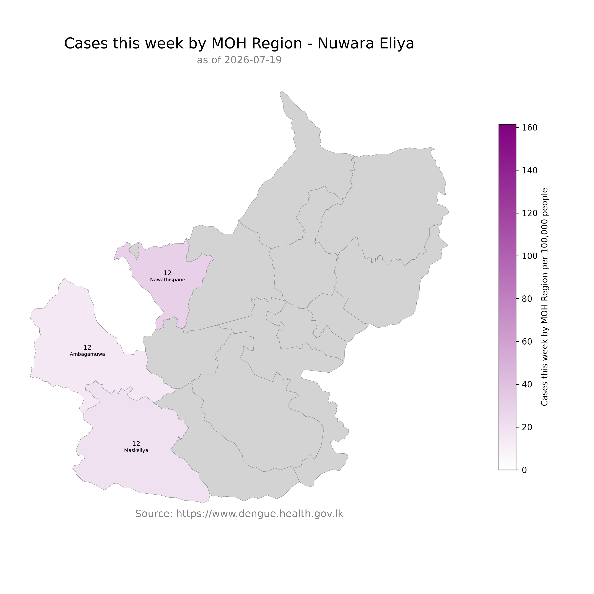
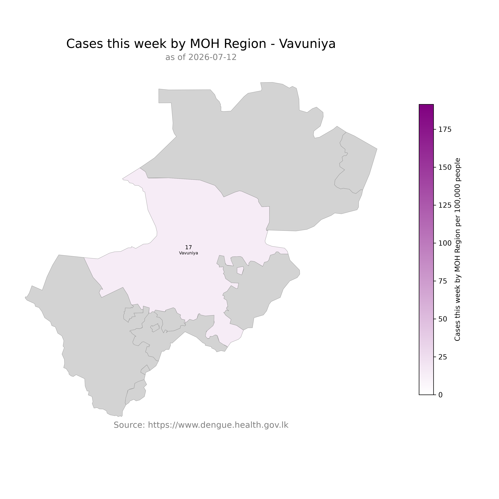
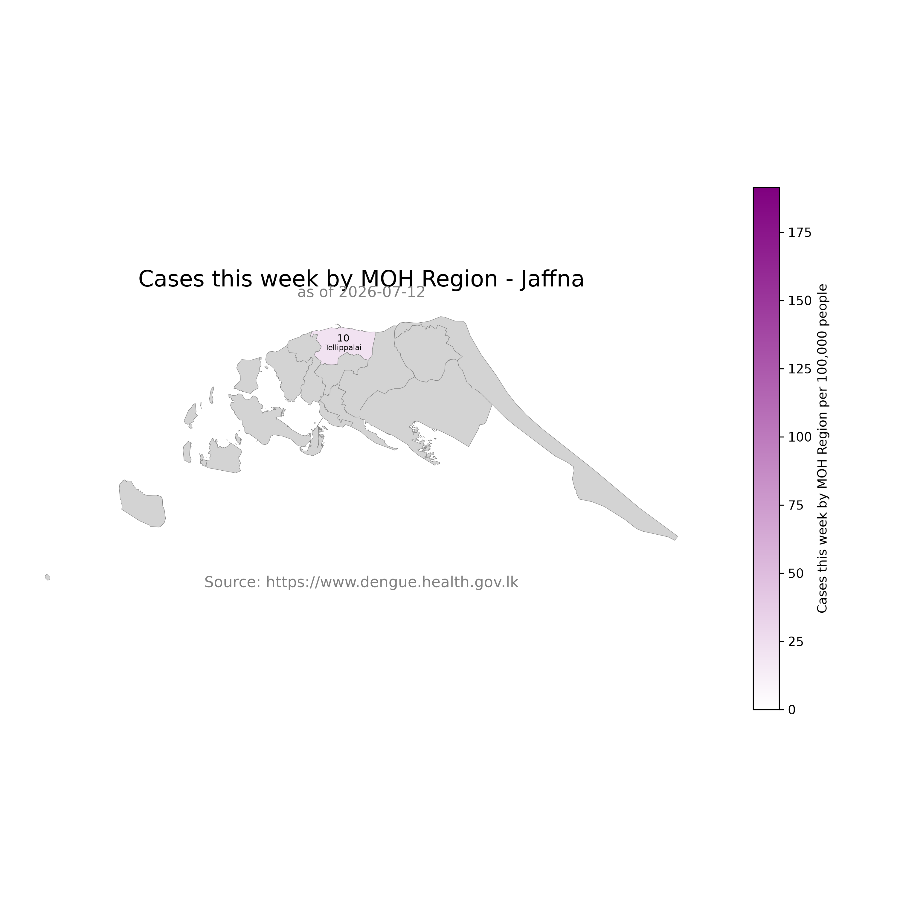

# Dengue in Sri Lanka 🇱🇰

Datasets scraped from [National Dengue Control Unit](https://www.dengue.health.gov.lk/) Website.

## Cases this week

## Additional Cases this week (compared to last week)

_by_region.png)

## Additional Cases this week (compared to this week, last year)

_by_region.png)

## Cumulative Deaths in 2026

## Cumulative Cases in 2026

## Cases this week by MOH Region

⚠️ These maps are based on 2020 MOH Region boundaries. Several MOH Regions created since lack public geographic data, so they have been merged with their parent regions. E.g., Kesbewa, formed by splitting the Piliyandala MOH Region, is shown combined as "Kesbewa & Piliyandala."

### Gampaha

### Colombo

### Kandy

### Ratnapura

### Kalutara

### Kegalle

### Puttalam

### Badulla

### Kurunegala

### Moneragala

### Polonnaruwa

### Ampara

### Batticaloa

### Nuwara Eliya

### Vavuniya

### Hambantota

### Matale

### Jaffna

## Cases by MOH Regions

As of 2026-07-12

| District | MOH Area | Cases Last Week | Cases This Week | Change | Population (2024 Census) | Cases Last Week per 100k | Cases This Week per 100k |
| --- | --- | ---: | ---: | --- | ---: | ---: | ---: |
| Gampaha | Kelaniya | 237 | 256 | 🔴 +19 | 133755 | 177.2 | 191.4 |
| Gampaha | Biyagama | 304 | 320 | 🔴 +16 | 207155 | 146.8 | 154.5 |
| Colombo | Boralesgamuwa | 91 | 86 | 🟢 -5 | 59240 | 153.6 | 145.2 |
| Colombo | Battaramulla | 86 | 121 | 🔴 +35 | 87511 | 98.3 | 138.3 |
| Kandy | Gangawata Korale & Kurunduwaththa | 76 | 71 | 🟢 -5 | 53141 | 143.0 | 133.6 |
| Colombo | Maharagama | 254 | 195 | 🟢 -59 | 155965 | 162.9 | 125.0 |
| Gampaha | Ja-Ela | 179 | 169 | 🟢 -10 | 137864 | 129.8 | 122.6 |
| Ratnapura | Rathnapura MC | 29 | 49 | 🔴 +20 | 42633 | 68.0 | 114.9 |
| Puttalam | Wennappuwa | 45 | 64 | 🔴 +19 | 64768 | 69.5 | 98.8 |
| Gampaha | Wattala | 175 | 153 | 🟢 -22 | 166517 | 105.1 | 91.9 |
| Gampaha | Mahara | 173 | 200 | 🔴 +27 | 226214 | 76.5 | 88.4 |
| Colombo | Nugegoda | 70 | 66 | 🟢 -4 | 75256 | 93.0 | 87.7 |
| Gampaha | Negombo | 110 | 103 | 🟢 -7 | 132907 | 82.8 | 77.5 |
| Colombo | Egodauyana & Moratuwa | 119 | 124 | 🔴 +5 | 160199 | 74.3 | 77.4 |
| Colombo | Rathmalana | 55 | 68 | 🔴 +13 | 88063 | 62.5 | 77.2 |
| Colombo | Pitakotte | 39 | 46 | 🔴 +7 | 61468 | 63.4 | 74.8 |
| Gampaha | Seeduwa | 119 | 87 | 🟢 -32 | 119832 | 99.3 | 72.6 |
| Colombo | Gothatuwa & Kolonnawa | 154 | 153 | 🟢 -1 | 214070 | 71.9 | 71.5 |
| Ratnapura | Kiriella | 23 | 23 | ⚪️ +0 | 33631 | 68.4 | 68.4 |
| Kandy | Yatinuwara | 68 | 77 | 🔴 +9 | 113769 | 59.8 | 67.7 |
| Kandy | Kandy MC | 103 | 103 | ⚪️ +0 | 152397 | 67.6 | 67.6 |
| Gampaha | Ragama | 78 | 56 | 🟢 -22 | 82930 | 94.1 | 67.5 |
| Colombo | Kaduwela | 140 | 128 | 🟢 -12 | 190407 | 73.5 | 67.2 |
| Gampaha | Katana | 77 | 82 | 🔴 +5 | 123983 | 62.1 | 66.1 |
| Colombo | Kesbewa & Piliyandala | 143 | 121 | 🟢 -22 | 204301 | 70.0 | 59.2 |
| Kandy | Werellagama | 47 | 56 | 🔴 +9 | 95757 | 49.1 | 58.5 |
| Badulla | Badulla | 30 | 48 | 🔴 +18 | 83033 | 36.1 | 57.8 |
| Kandy | Gampola | 45 | 63 | 🔴 +18 | 109092 | 41.2 | 57.7 |
| Kalutara | Bandaragama | 91 | 71 | 🟢 -20 | 124133 | 73.3 | 57.2 |
| Ratnapura | Kalawana | 18 | 29 | 🔴 +11 | 50753 | 35.5 | 57.1 |
| Gampaha | Pugoda(Dompe) | 75 | 93 | 🔴 +18 | 169223 | 44.3 | 55.0 |
| Kalutara | Horana | 91 | 70 | 🟢 -21 | 133685 | 68.1 | 52.4 |
| Kandy | Udunuwara | 38 | 37 | 🟢 -1 | 70803 | 53.7 | 52.3 |
| Colombo | CMC & D1-CMC & D2A-CMC & D2B-CMC & D3-CMC & D4-CMC & D5-CMC | 221 | 265 | 🔴 +44 | 508408 | 43.5 | 52.1 |
| Gampaha | Gampaha | 98 | 104 | 🔴 +6 | 201818 | 48.6 | 51.5 |
| Kandy | Hatharaliyadda | 7 | 16 | 🔴 +9 | 31141 | 22.5 | 51.4 |
| Ratnapura | Ratnapura PS | 26 | 40 | 🔴 +14 | 78533 | 33.1 | 50.9 |
| Ratnapura | Ayagama | 6 | 16 | 🔴 +10 | 31506 | 19.0 | 50.8 |
| Colombo | Padukka | 33 | 36 | 🔴 +3 | 73014 | 45.2 | 49.3 |
| Ratnapura | Nivithigala | 13 | 29 | 🔴 +16 | 59442 | 21.9 | 48.8 |
| Colombo | Homagama | 112 | 86 | 🟢 -26 | 179146 | 62.5 | 48.0 |
| Kandy | Bambaradeniya | 17 | 23 | 🔴 +6 | 47868 | 35.5 | 48.0 |
| Ratnapura | Elapatha | 10 | 17 | 🔴 +7 | 36867 | 27.1 | 46.1 |
| Gampaha | Minuwangoda | 100 | 91 | 🟢 -9 | 197883 | 50.5 | 46.0 |
| Colombo | Dehiwala | 27 | 42 | 🔴 +15 | 93815 | 28.8 | 44.8 |
| Kandy | Doluwa | 22 | 24 | 🔴 +2 | 53535 | 41.1 | 44.8 |
| Kandy | Pasbage | 26 | 29 | 🔴 +3 | 65553 | 39.7 | 44.2 |
| Kegalle | Mawanella | 23 | 54 | 🔴 +31 | 126026 | 18.3 | 42.8 |
| Monaragala | Siyambalanduwa | 10 | 27 | 🔴 +17 | 63055 | 15.9 | 42.8 |
| Colombo | Hanwella | 45 | 48 | 🔴 +3 | 122128 | 36.8 | 39.3 |
| Puttalam | Chilaw & Madampe | 34 | 43 | 🔴 +9 | 112633 | 30.2 | 38.2 |
| Puttalam | Nattandiya | 25 | 25 | ⚪️ +0 | 65500 | 38.2 | 38.2 |
| Badulla | Uva Paranagama | 11 | 31 | 🔴 +20 | 82069 | 13.4 | 37.8 |
| Kandy | Menikhinna | 34 | 25 | 🟢 -9 | 67384 | 50.5 | 37.1 |
| Ratnapura | Kuruvita | 29 | 36 | 🔴 +7 | 97966 | 29.6 | 36.7 |
| Batticaloa | Eravur | 5 | 14 | 🔴 +9 | 39491 | 12.7 | 35.5 |
| Colombo | Kahathuduwa | 66 | 36 | 🟢 -30 | 101625 | 64.9 | 35.4 |
| Kegalle | Dehiovita | 32 | 30 | 🟢 -2 | 84967 | 37.7 | 35.3 |
| Ampara | Ampara | 8 | 13 | 🔴 +5 | 37604 | 21.3 | 34.6 |
| Ratnapura | Eheliyagoda | 32 | 25 | 🟢 -7 | 74071 | 43.2 | 33.8 |
| Gampaha | Aththanagalla | 59 | 67 | 🔴 +8 | 199017 | 29.6 | 33.7 |
| Kegalle | Yatiyanthota | 14 | 21 | 🔴 +7 | 62255 | 22.5 | 33.7 |
| Puttalam | Dankotuwa | 14 | 19 | 🔴 +5 | 62873 | 22.3 | 30.2 |
| Kandy | Thalathuoya | 16 | 18 | 🔴 +2 | 59835 | 26.7 | 30.1 |
| Kandy | Poojapitiya | 11 | 18 | 🔴 +7 | 60316 | 18.2 | 29.8 |
| Ratnapura | Pelmadulla | 38 | 28 | 🟢 -10 | 93818 | 40.5 | 29.8 |
| Nuwara Eliya | Nawathispane | 8 | 11 | 🔴 +3 | 40193 | 19.9 | 27.4 |
| Kalutara | Walasmulla | 21 | 13 | 🟢 -8 | 47869 | 43.9 | 27.2 |
| Ratnapura | Kolonna | 7 | 13 | 🔴 +6 | 48237 | 14.5 | 27.0 |
| Ampara | Uhana | 18 | 17 | 🟢 -1 | 64683 | 27.8 | 26.3 |
| Kurunegala | Kurunegala & MC Kurunegala | 24 | 23 | 🟢 -1 | 88638 | 27.1 | 25.9 |
| Kandy | Waththegama | 31 | 25 | 🟢 -6 | 96889 | 32.0 | 25.8 |
| Polonnaruwa | Medirigiriya | 20 | 18 | 🟢 -2 | 72482 | 27.6 | 24.8 |
| Kurunegala | Polpithigama | 14 | 21 | 🔴 +7 | 86411 | 16.2 | 24.3 |
| Ratnapura | Imbulpe | 10 | 15 | 🔴 +5 | 64555 | 15.5 | 23.2 |
| Jaffna | Tellippalai | 2 | 10 | 🔴 +8 | 45794 | 4.4 | 21.8 |
| Kandy | Kundasale | 22 | 16 | 🟢 -6 | 73586 | 29.9 | 21.7 |
| Kalutara | Bulathsinhala | 12 | 14 | 🔴 +2 | 65550 | 18.3 | 21.4 |
| Kegalle | Ruwanwella | 12 | 14 | 🔴 +2 | 65797 | 18.2 | 21.3 |
| Badulla | Welimada | 13 | 22 | 🔴 +9 | 105510 | 12.3 | 20.9 |
| Ampara | Damana | 10 | 10 | ⚪️ +0 | 48364 | 20.7 | 20.7 |
| Kegalle | Warakapola | 29 | 24 | 🟢 -5 | 117967 | 24.6 | 20.3 |
| Gampaha | Meerigama | 39 | 35 | 🟢 -4 | 176309 | 22.1 | 19.9 |
| Badulla | Rideemaliyadda | 13 | 12 | 🟢 -1 | 60882 | 21.4 | 19.7 |
| Polonnaruwa | Thamankaduwa | 6 | 17 | 🔴 +11 | 89110 | 6.7 | 19.1 |
| Batticaloa | Batticaloa | 20 | 16 | 🟢 -4 | 85114 | 23.5 | 18.8 |
| Kandy | Medadumbara | 12 | 12 | ⚪️ +0 | 64539 | 18.6 | 18.6 |
| Kurunegala | Galgamuwa | 21 | 16 | 🟢 -5 | 90076 | 23.3 | 17.8 |
| Kurunegala | Pannala | 18 | 24 | 🔴 +6 | 135845 | 13.3 | 17.7 |
| Gampaha | Divulapitiya | 38 | 27 | 🟢 -11 | 158286 | 24.0 | 17.1 |
| Kurunegala | Alawwa | 10 | 11 | 🔴 +1 | 65689 | 15.2 | 16.7 |
| Polonnaruwa | Hingurakoda | 12 | 12 | ⚪️ +0 | 74862 | 16.0 | 16.0 |
| Badulla | Hali Ela | 10 | 15 | 🔴 +5 | 94792 | 10.5 | 15.8 |
| Monaragala | Monaragala | 11 | 16 | 🔴 +5 | 101565 | 10.8 | 15.8 |
| Nuwara Eliya | Ambagamuwa | 25 | 12 | 🟢 -13 | 82685 | 30.2 | 14.5 |
| Vavuniy | Vavuniya | 4 | 17 | 🔴 +13 | 116991 | 3.4 | 14.5 |
| Kegalle | Rambukkana | 14 | 12 | 🟢 -2 | 87055 | 16.1 | 13.8 |
| Matale | Ukuwela | 14 | 10 | 🟢 -4 | 72313 | 19.4 | 13.8 |
| Monaragala | wellawaya | 7 | 10 | 🔴 +3 | 73280 | 9.6 | 13.6 |
| Ratnapura | Balangoda | 13 | 11 | 🟢 -2 | 88914 | 14.6 | 12.4 |
| Ratnapura | Embilipitiya | 5 | 10 | 🔴 +5 | 159438 | 3.1 | 6.3 |

## Cases by Hospitals

As of 2026-07-12

| Hospital | Cases Last Week | Cases This Week |
| --- | ---: | ---: |
| NIID | 212 | 213 |
| TH-Matara | 195 | 187 |
| TH - Colombo South | 175 | 178 |
| TH - Colombo North | 143 | 167 |
| NHSL | 152 | 144 |
| DGH - Negambo | 169 | 140 |
| NH - Kandy | 107 | 102 |
| NH - Galle | 122 | 101 |
| BH - Panadura | 86 | 92 |
| DGH - Gampaha | 81 | 79 |
| LRH | 74 | 78 |
| TH - Peradeniya | 75 | 77 |
| TH - Kalutara | 61 | 71 |
| TH - Ratnapura | 84 | 64 |
| BH - Tangalle | 58 | 54 |
| PGH - Badulla | 35 | 44 |
| DGH - Horana | 47 | 43 |
| BH - Gampola | 29 | 42 |
| BH - Marawila | 38 | 39 |
| BH - Kamburupitiya | 38 | 38 |
| TH - Kuliyapitiya | 26 | 34 |
| DGH - Awissawella | 34 | 33 |
|  | 27 | 28 |
|  | 27 | 28 |
|  | 27 | 28 |
| BH - Wathupitiwala | 31 | 28 |
| DGH - Embilipitiya | 20 | 27 |
| DGH - Kegalle | 20 | 26 |
| BH - Minuwangoda | 22 | 25 |
| BH - Balapitiya | 36 | 24 |
| BH - Kahawatta | 22 | 23 |
| DGH - Chilaw | 18 | 22 |
| BH - Balangoda | 31 | 20 |
| BH - Mahiyanganaya | 15 | 20 |
| DGH - Monaragala | 13 | 20 |
| DGH - Nawalapitiya | 20 | 20 |
| DGH - Polonnaruwa | 17 | 20 |
| BH - Mawanella | 14 | 19 |
| BH - Dambadeniya | 18 | 18 |
| BH - Nikaweratiya | 21 | 18 |
| DGH - Hambantota | 26 | 18 |
| BH - Karawanella | 16 | 17 |
| DGH - Matale | 20 | 17 |

## Appendix: Source Reports & Extracted Data

### [National Dengue Control Unit - Daily Update](data/NDCUDaily)

- [2026-07-20](data/NDCUDaily/2026/2026-07/2026-07-20)
- [2026-07-19](data/NDCUDaily/2026/2026-07/2026-07-19)
- [2026-07-18](data/NDCUDaily/2026/2026-07/2026-07-18)
- [2026-07-17](data/NDCUDaily/2026/2026-07/2026-07-17)
- [2026-07-16](data/NDCUDaily/2026/2026-07/2026-07-16)
- [2026-07-15](data/NDCUDaily/2026/2026-07/2026-07-15)
- [2026-07-14](data/NDCUDaily/2026/2026-07/2026-07-14)
- [2026-07-13](data/NDCUDaily/2026/2026-07/2026-07-13)
- [2026-07-12](data/NDCUDaily/2026/2026-07/2026-07-12)
- [2026-07-11](data/NDCUDaily/2026/2026-07/2026-07-11)
- [2026-07-10](data/NDCUDaily/2026/2026-07/2026-07-10)
- [2026-07-09](data/NDCUDaily/2026/2026-07/2026-07-09)
- [2026-07-08](data/NDCUDaily/2026/2026-07/2026-07-08)
- [2026-07-07](data/NDCUDaily/2026/2026-07/2026-07-07)
- [2026-07-06](data/NDCUDaily/2026/2026-07/2026-07-06)
- [2026-07-04](data/NDCUDaily/2026/2026-07/2026-07-04)
- [2026-07-03](data/NDCUDaily/2026/2026-07/2026-07-03)
- [2026-07-02](data/NDCUDaily/2026/2026-07/2026-07-02)
- [2026-07-01](data/NDCUDaily/2026/2026-07/2026-07-01)
- [2026-06-30](data/NDCUDaily/2026/2026-06/2026-06-30)
- [2026-06-29](data/NDCUDaily/2026/2026-06/2026-06-29)
- [2026-06-28](data/NDCUDaily/2026/2026-06/2026-06-28)
- [2026-06-27](data/NDCUDaily/2026/2026-06/2026-06-27)
- [2026-06-26](data/NDCUDaily/2026/2026-06/2026-06-26)
- [2026-06-24](data/NDCUDaily/2026/2026-06/2026-06-24)
- [2026-06-23](data/NDCUDaily/2026/2026-06/2026-06-23)
- [2026-06-22](data/NDCUDaily/2026/2026-06/2026-06-22)
- [2026-06-20](data/NDCUDaily/2026/2026-06/2026-06-20)

### [National Dengue Control Unit - Weekly Update](data/NDCUWeekly)

- [2026-07-12](data/NDCUWeekly/2026/2026-07/2026-07-12)
- [2026-07-05](data/NDCUWeekly/2026/2026-07/2026-07-05)
- [2026-06-28](data/NDCUWeekly/2026/2026-06/2026-06-28)
- [2026-06-21](data/NDCUWeekly/2026/2026-06/2026-06-21)
- [2026-06-14](data/NDCUWeekly/2026/2026-06/2026-06-14)
- [2026-05-24](data/NDCUWeekly/2026/2026-05/2026-05-24)
- [2026-05-10](data/NDCUWeekly/2026/2026-05/2026-05-10)

